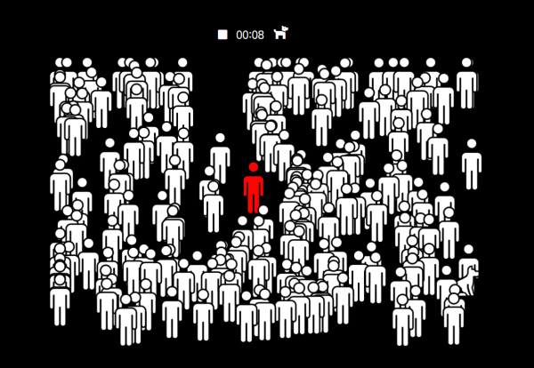

# 🐶 Find lost Pet
 
 

 
 

# 📜 Explanation
제한시간 내에 많은 인파를 뒤집고 숨어있는 애완동물을 찾는 게임

 
 

# 🔎 How to
1. 'ASDW' 키를 사용하여 플레이어를 움직입니다. 
2. 사람들은 플레이어와 가까워지면 일정 거리 피하게 됩니다.
3. 인파 속에 숨어있는 애완동물을 찾으면 마우스로 클릭하세요. 플레이어의 승리입니다.
4. 만약에 '정지'버튼을 누르거나 제한 시간에 찾지 못한다면 플레이어의 패배입니다.

 
 

# 💻Built With
- HTML
- CSS
- JavaScript(ES6)

 
 

# 💡 To the Next
- [ ] Code Refactoring
- [ ] Level up System

 
 

# 🎮 Try Website
###  https://jinnnii.github.io/Find-lost-pet/
